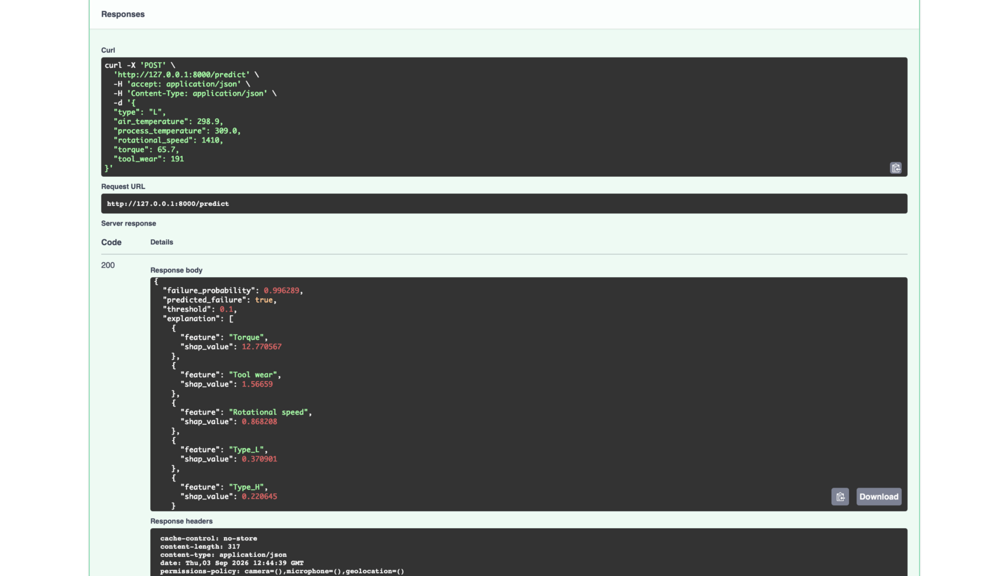
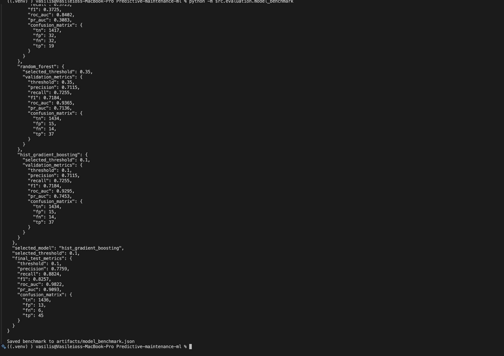
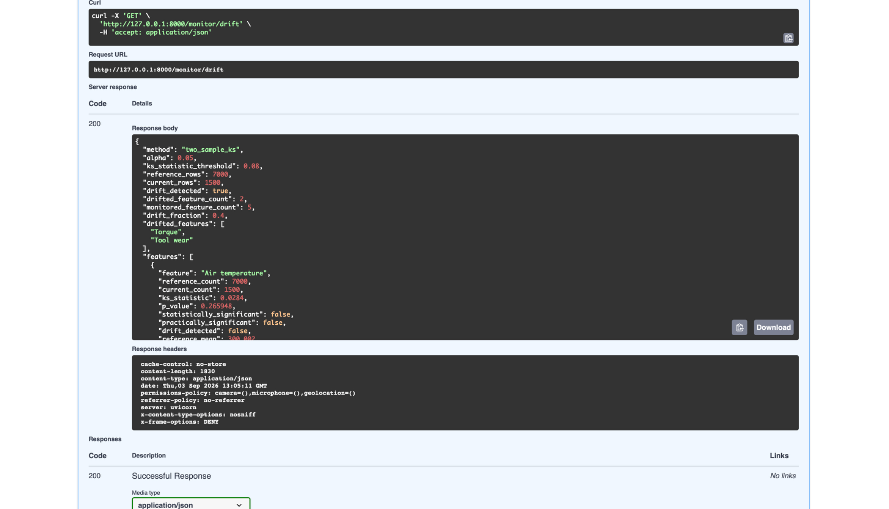

# Predictive Maintenance ML System

[](https://github.com/vasilischr01/Predictive-maintenance-ml/actions/workflows/ci.yml)

Production-style machine learning system for predicting industrial equipment failures from operational and sensor data.

The project covers the full ML lifecycle: **data validation, leakage-free evaluation, model benchmarking, threshold optimization, MLflow experiment tracking, SHAP explainability, FastAPI serving, statistical drift monitoring, automated testing, CI, and Docker deployment**.

---

## What It Does

- Predicts machine failure probability from operational sensor data
- Uses a leakage-free **70 / 15 / 15 train-validation-test split**
- Benchmarks Logistic Regression, Random Forest, and HistGradientBoosting
- Selects the production model using **validation PR-AUC**
- Optimizes the classification threshold using validation data only
- Evaluates the final locked model on an **untouched test set**
- Returns real-time predictions through FastAPI
- Provides feature-level explanations using **SHAP**
- Tracks experiments and model artifacts with **MLflow**
- Detects feature drift using two-sample Kolmogorov-Smirnov tests
- Includes automated tests, GitHub Actions CI, and Dockerized execution

---

## Architecture

```text
                         Raw Machine Data
                                |
                                v
                         Data Validation
                                |
                                v
                  Stratified Train / Val / Test
                                |
                    +-----------+-----------+
                    |                       |
                    v                       v
             Model Benchmark          Training Pipeline
             LR / RF / HGB          Preprocessing + HGB
                    |                       |
                    +-----------+-----------+
                                |
                                v
                    Validation Threshold Search
                                |
                                v
                  Production Model + Threshold
                                |
                    +-----------+-----------+
                    |                       |
                    v                       v
                  MLflow                  FastAPI
                                            |
                                 +----------+----------+
                                 |                     |
                                 v                     v
                               SHAP              Drift Monitoring
```

---

## Demo

### Failure Prediction + SHAP Explainability

A real machine-failure example is served through the prediction API.

The model returns the failure probability, classification decision, validation-selected threshold, and feature-level SHAP contributions.



### Model Benchmark & Final Evaluation

The benchmark compares multiple classifiers using validation data for model and threshold selection.

The test set remains untouched until final evaluation.



### Drift Monitoring

The monitoring endpoint compares reference and current feature distributions using two-sample Kolmogorov-Smirnov tests combined with a practical effect-size threshold.



---

## Final Model Performance

The production model is a:

```text
HistGradientBoostingClassifier
```

Dataset split:

| Split | Rows | Fraction |
|---|---:|---:|
| Training | 7,000 | 70% |
| Validation | 1,500 | 15% |
| Test | 1,500 | 15% |

Model selection and threshold optimization use only training and validation data.

The test set is isolated until the final evaluation.

### Untouched Test Set

| Metric | Result |
|---|---:|
| Precision | **0.7759** |
| Recall | **0.8824** |
| F1 Score | **0.8257** |
| ROC-AUC | **0.9822** |
| PR-AUC | **0.9093** |
| Decision Threshold | **0.10** |

Confusion matrix:

|  | Predicted Normal | Predicted Failure |
|---|---:|---:|
| Actual Normal | **1436** | **13** |
| Actual Failure | **6** | **45** |

The final operating point detects **45 of 51 machine failures**, corresponding to **88.24% recall**.

---

## Model Benchmark

Three classifiers are compared:

| Model | Threshold | Validation Precision | Validation Recall | Validation F1 | ROC-AUC | PR-AUC |
|---|---:|---:|---:|---:|---:|---:|
| Logistic Regression | 0.88 | 0.3725 | 0.3725 | 0.3725 | 0.8402 | 0.3083 |
| Random Forest | 0.35 | 0.7115 | 0.7255 | 0.7184 | **0.9366** | 0.7136 |
| **HistGradientBoosting** | **0.10** | **0.7115** | **0.7255** | **0.7184** | 0.9295 | **0.7453** |

Production model selection uses:

```text
Primary metric: validation PR-AUC
Tie-breakers: validation F1, validation recall
```

HistGradientBoosting achieved the highest validation PR-AUC and was selected for production.

The test set is **not used for model selection**.

---

## Leakage-Free Evaluation

```text
Full Dataset
     |
     v
Stratified Split
     |
     +----------------------------+
     |                            |
     v                            v
70% Training                 15% Validation
                                  |
                                  +--> Model selection
                                  +--> Threshold optimization
                                  |
                                  v
                            Selection locked
                                  |
                                  v
                             15% Test Set
                                  |
                                  v
                         Final evaluation only
```

This prevents test information from influencing model or threshold selection.

Because machine failures are rare, evaluation emphasizes:

- PR-AUC
- ROC-AUC
- Recall
- Precision
- F1
- Confusion matrix

---

## Explainability

Predictions include feature-level SHAP explanations.

The explainability pipeline:

1. Loads the fitted preprocessing and model pipeline
2. Transforms the incoming observation
3. Computes SHAP values
4. Ranks features by absolute contribution
5. Returns the strongest feature contributions with the prediction

The model and SHAP explainer are cached after first use.

---

## Drift Monitoring

Numerical features are evaluated using a two-sample Kolmogorov-Smirnov test.

A feature is classified as drifted when:

```text
p-value < 0.05

AND

KS statistic >= 0.08
```

The monitoring report includes:

- KS statistic
- p-value
- reference and current sample counts
- mean shift
- standard deviation
- practical significance
- per-feature drift decision

In the controlled drift experiment:

| Feature | KS Statistic | Drift |
|---|---:|---|
| Air temperature | 0.0284 | No |
| Process temperature | 0.0386 | No |
| Rotational speed | 0.0271 | No |
| **Torque** | **0.3106** | **Yes** |
| **Tool wear** | **0.1032** | **Yes** |

The current monitoring endpoint correctly reports:

```text
drift_detected: true
drifted_feature_count: 2
drifted_features:
- Torque
- Tool wear
```

---

## MLflow Experiment Tracking

Training runs log:

- model configuration
- random seed
- dataset split proportions
- validation-selected threshold
- validation metrics
- final test metrics
- serialized model
- metrics artifact
- threshold artifact

Configuration is environment-driven through:

```text
MLFLOW_TRACKING_URI
MLFLOW_EXPERIMENT_NAME
```

---

## API

| Method | Endpoint | Purpose |
|---|---|---|
| `GET` | `/health` | Service and model health |
| `POST` | `/predict` | Failure prediction with SHAP explanation |
| `GET` | `/monitor/drift` | Feature-distribution drift analysis |

Start the API:

```bash
uvicorn src.api.main:app --reload
```

Interactive Swagger documentation:

```text
http://127.0.0.1:8000/docs
```

The prediction response contains:

```text
failure_probability
predicted_failure
threshold
SHAP feature contributions
```

---

## Engineering & Reliability

The API includes:

- Pydantic input validation
- request-size limits
- rate limiting
- security headers
- sanitized client-facing errors
- cached model loading
- cached SHAP explainer
- persisted model and threshold artifacts

Current validation:

```text
27 automated tests passed
Ruff: All checks passed
GitHub Actions CI
Docker build validated
Leakage-free evaluation
Drift monitoring covered by tests
```

---

## Tech Stack

**Machine Learning:** Python, scikit-learn, pandas, NumPy

**Evaluation:** ROC-AUC, PR-AUC, Precision, Recall, F1, confusion matrices

**MLOps / Explainability:** MLflow, SHAP, SciPy

**Serving:** FastAPI, Uvicorn, Pydantic

**Monitoring:** Kolmogorov-Smirnov drift detection

**Engineering:** Docker, pytest, Ruff, GitHub Actions

---

## Dataset

The project uses the **AI4I 2020 Predictive Maintenance Dataset** from the UCI Machine Learning Repository.

Production features:

```text
Type
Air temperature
Process temperature
Rotational speed
Torque
Tool wear
```

Identifier fields and failure-mode indicator columns are excluded from the production feature set to avoid target-related leakage.

---

## Run Locally

Create and activate a virtual environment:

```bash
python3 -m venv .venv
source .venv/bin/activate
```

Install dependencies:

```bash
pip install -r requirements.txt
```

Run training:

```bash
python -m src.training.train
```

Start the API:

```bash
uvicorn src.api.main:app --reload
```

---

## Run the Model Benchmark

```bash
python -m src.evaluation.model_benchmark
```

---

## Run Drift Analysis

```bash
python -m src.monitoring.drift
```

---

## Testing

```bash
pytest -q
```

Linting:

```bash
ruff check .
```

---

## Docker

Build:

```bash
docker build -t predictive-maintenance-api .
```

Run:

```bash
docker run --rm -p 8000:8000 predictive-maintenance-api
```

The Docker build trains the production model during image creation, allowing the runtime image to contain the required inference artifacts without committing generated model binaries.

---

## Limitations

- The project currently uses one public predictive-maintenance dataset
- Drift monitoring measures statistical feature drift rather than full concept drift
- The drift demonstration uses controlled synthetic distribution shifts
- No automated retraining trigger is currently implemented
- No persistent production prediction database is included
- Deployment is currently local/containerized rather than managed cloud infrastructure
- The rate limiter is process-local
- Authentication and RBAC are not currently included

---

## Why This Project

This project demonstrates more than fitting a classifier.

It implements a complete production-oriented ML workflow with **leakage-free evaluation, benchmark-driven model selection, threshold optimization, explainability, experiment tracking, API serving, drift monitoring, automated testing, and reproducible deployment**.

---

## License

MIT License.